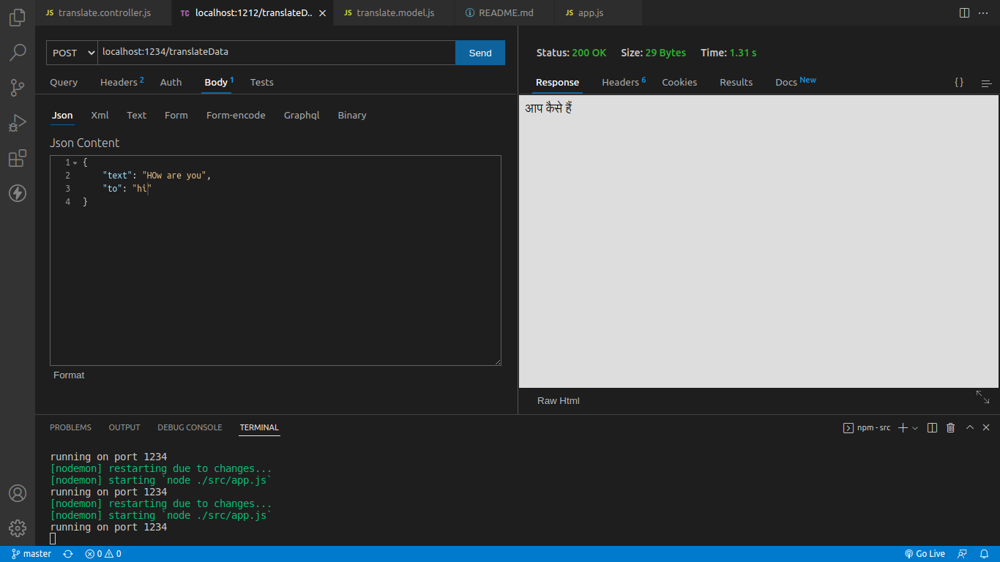

# Translation API

### Goal
- A web server that exposes an API to translate a text.

### Tech stack used
-  `NodeJS` & `ExpressJS` (a flexible Node.js web application framework) as beckend.
-  `Google translate` as an external service for actual translation.
- `mongoose` for MongoDB connection

## Install Dependencies

```
npm install dependenciesName
```

## Run the app
```
npm run server
```

## Usage 
To get the translation, we can use Postman or we can simply use Thunder Client in VScode and hit this API as follow:
```
localhost:1234/translateData
```
after entering this url in above mentioned, select POST method and select body then json and then pass the parameters text: `The text that you want to translate` to: `the ISO code e.g.` `hi`


<br>**NOTE:**
  - for the `targetLangauge`, only **ISO Language code** should be passed as value.
<br/>For example:
    - "hi" for Hindi
    - "ja" for Japanese
    - "fa" for Persian, etc.
    <br/>A list of all [ISO Language Codes](https://datahub.io/core/language-codes/r/0.html) is attached here.

- A sample example is shown here when we hit the route on Thunder Client.

